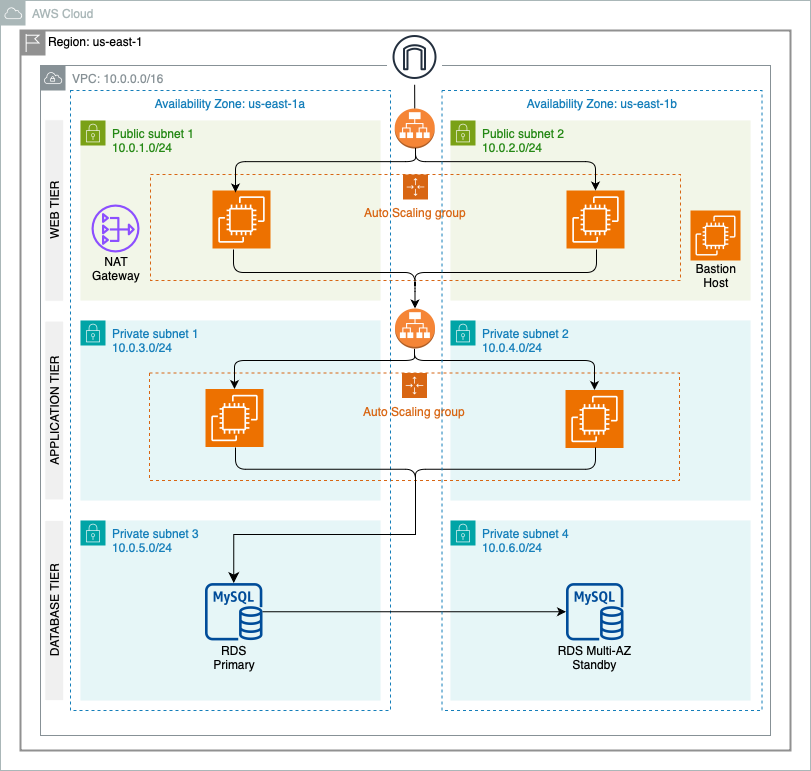

# AWS 3-Tier Architecture using Terraform

<p align="center">

</p>

## Introduction

In this project, we will configure and deploy a robust three-tier architecture infrastructure on AWS using Terraform. The three-tier architecture is a well-established design pattern that organizes an application into three distinct layers, each with its own responsibilities:

1. **Web Tier (Frontend)**: Presents the user interface and manages user interactions. This tier captures user input and sends requests to the Application Tier.

2. **Application Tier (Backend)**: Contains the core application logic and processes requests from the Web Tier. It executes business logic and communicates with the Database Tier to retrieve, update or manage data.

3. **Database Tier (Data)**: Stores and manages all application data. It handles data creation, retrieval, updates, and deletion based on requests from the Application Tier, ensuring data integrity and security.

<br/>

## Benefits of 3 Tier Architecture

The chief benefit of the 3-tier architecture is that each tier operates on its own infrastructure which enhances the overall system’s flexibility and resilience. This separation allows for:

- *Independent Scaling*: Each tier can be scaled independently based on its specific load and performance requirements, optimizing resource utilization and cost.

- *Isolation of Issues*: Problems or failures in one tier do not directly impact other tiers, improving system reliability and fault tolerance.

- *Focused Development*: Developers can work on and improve different tiers independently, allowing for *focused optimization* and *feature development* without affecting other tiers.

- *Enhanced Security*: Isolating the user interface from the Application Tier and the Database Tier limits access to sensitive data and application logic. This reduces the risk of unauthorized access and data breaches, enhancing overall data protection and system security.

Additionally, using Terraform in this project automates and streamlines infrastructure management, ensuring consistent and repeatable deployments across environments. 

<br/>

## Terraform Configuration Files

| **File**          | **Components**                                             | **Purpose** |
|-------------------|------------------------------------------------------------|-------------|
| **vpc.tf**        | `VPC` <br> `Subnets` <br> `Subnet Groups`                  | Defines VPC and network resources: <ul><li>2 Availability Zones</li><li>2 Public subnets for Web Tier</li><li>2 Private subnets each for Application and Database Tiers</li></ul> |
| **network.tf**    | `Elastic IP` <br> `NAT Gateway` <br> `Internet Gateway` <br> `Route Tables` <br> `Route Table Associations` | Configures network infrastructure: <ul><li>Sets up network components and routing rules</li></ul> |
| **security.tf**   | `Security Groups`                                         | Manages security groups and access: <ul><li>Web servers: Allow traffic only from the Web Tier ALB</li><li>Application servers: Allow traffic only from Web Tier instances</li><li>Database servers: Allow traffic only from App Tier instances</li></ul> |
| **web_tier.tf**   | `Load Balancer` <br> `Load Balancer Listener` <br> `Auto Scaling Group` <br> `Launch Template` <br> `Target Group` | Configures Web Tier resources: <ul><li>Manages web resources including load balancing and auto scaling</li></ul> |
| **app_tier.tf**   | `Load Balancer` <br> `Load Balancer Listener` <br> `Auto Scaling Group` <br> `Launch Template` <br> `Target Group` | Configures Application Tier resources: <ul><li>Manages application resources including load balancing and auto scaling</li></ul> |
| **database_tier.tf** | `RDS Instance` <br> `DB Subnet Group`                       | Configures Database Tier resources: <ul><li>Sets up RDS MySQL and its subnet group</li></ul> |

<br/>

## Creating EC2 Key Pairs

To securely connect to your EC2 instances, you need to create a key pair.
Run the following commands to create a key pair for the web tier and app tier respectively

```
ssh-keygen -t rsa -b 4096 -f ~/.ssh/my_web_key -C "web tier key"

ssh-keygen -t rsa -b 4096 -f ~/.ssh/my_app_key -C "app tier key"
```


<br/>
